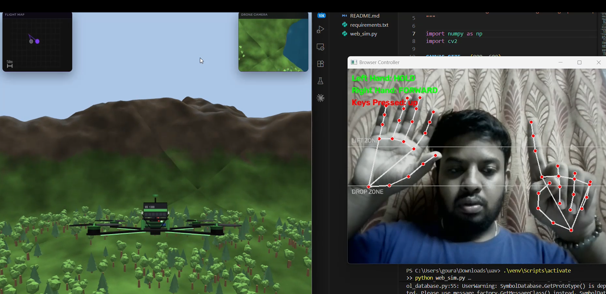

# drone-gesture / LumipadDrones Gesture Controller

This project allows you to control the "LumipadDrones" web game using hand gestures via your webcam. 



## Setup
```bash
python -m venv venv
venv\Scripts\activate
pip install -r requirements.txt
pip install pydirectinput
```

## Running the Controller
```bash
python web_sim.py
```

## Gestures
Make sure your browser window is focused so it can receive the keyboard commands!

**Left Hand (Altitude):**
Make a Fist.
- Lift Fist up into the top zone -> Throttle Up (`w`)
- Drop Fist down into the bottom zone -> Throttle Down (`s`)
- Hold in middle -> Hover

**Right Hand (Direction):**
- ☝️ Index finger only -> Pitch Forward (Up Arrow)
- ✌️ Index + Middle fingers -> Pitch Backward (Down Arrow)
- 👍 Thumb only -> Turn Left (`a`)
- 🤙 Pinky only -> Turn Right (`d`)

Press `q` on the webcam window to exit.
